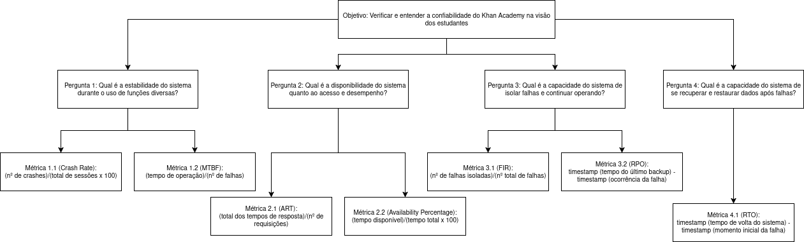

## Objetivo de Medição 2: Confiabilidade

    <table border="1" cellspacing="0" cellpadding="8" style="border-collapse: collapse; text-align: left;">
        <tr>
            <th><b>Analisar</b></th>
            <td>o Khan Academy</td>
        </tr>
        <tr>
            <th><b>Para o propósito de</b></th>
            <td>Verificar e entender</td>
        </tr>
        <tr>
            <th><b>Com respeito a</b></th>
            <td>Confiabilidade</td>
        </tr>
        <tr>
            <th><b>Do ponto de vista da</b></th>
            <td>Comunidade de estudantes</td>
        </tr>
        <tr>
            <th><b>No contexto da</b></th>
            <td>Disciplina de Qualidade de Software 1 (FCTE - UnB)</td>
        </tr>
    </table>

    
        <figcaption>Tabela 1: Objetivo de Medição: Confiabilidade</figcaption>
    

-----

### Perguntas e Hipóteses de Medição

**Questão 1: Maturidade**

> Qual é a estabilidade do sistema durante o uso de funções diversas?

- **Hipótese 1.1 (H1.1):** O **Crash Rate (CR)** por sessão de usuário na plataforma (web e mobile) será, em média, inferior a **[0.15%](https://www.alphabin.co/blog/mobile-app-testing-crash-rates)**.
- **Hipótese 1.2 (H1.2):** O **Mean Time Between Failure (MTBF)** do serviço principal será superior a 30 horas de operação contínua antes de uma falha.

**Questão 2: Disponibilidade**

> Qual é a disponibilidade do sistema quanto ao acesso e desempenho?

- **Hipótese 2.1 (H2.1):** O **Average Response Time (ART)** para ações críticas do usuário (início de vídeo ou exercício) será, em média, de até **[1 segundo](https://www.headspin.io/blog/how-to-test-application-response-time-for-overall-app-success)**.
- **Hipótese 2.2 (H2.2):** O **Availability Percentage** para o sistema deverá ser maior ou igual a **[99%](https://www.penguinsolutions.com/en-us/resources/blog/rule-nines-availability-always-on-world)**, ou seja, o mesmo não deve ficar fora do ar por mais que 87.6 horas ao ano.

**Questão 3: Tolerância a Falhas**

> Qual é a capacidade do sistema de isolar falhas e continuar operando?”

- **Hipótese 3.1 (H3.1):** O **Fault Isolation Rate (FIR)** será de, no mínimo, **[90%](https://support.ptc.com/help/wrr/r13.0.0.0/en/wrr/ReferenceGuide/fmea/isolation_percentage.html)** para falhas não-críticas, permitindo que o usuário continue navegando.
- **Hipótese 3.2 (H3.2):** O **Recovery Point Objective (RPO)** será de, no máximo, **[5 minutos](https://www.headspin.io/blog/how-to-test-application-response-time-for-overall-app-success)**, garantindo que a perda de dados ou progresso do aluno em caso de falha seja mínima e aceitável.

**Questão 4: Recuperabilidade**

> Qual é a capacidade do sistema de se recuperar e restaurar dados após falhas?

- **Hipótese 4.1 (H4.1):** O **Recovery Time Objective (RTO)** para restaurar a funcionalidade total do sistema será de, no máximo, **[5 minutos](https://aws.amazon.com/blogs/mt/establishing-rpo-and-rto-targets-for-cloud-applications/)**.

-----

### Seleção das Métricas

**Questão 1: Maturidade**

- **Métrica 1.1: Crash Rate (CR)**
    - **Definição:** Percentual de sessões de usuário que terminam em *crash*.
    - **Fórmula:** $CR = \frac{Número\ de\ Crashes}{Número\ Total\ de\ Sessões} \times 100\%$
    - **Coleta:**
        - Serão registrados os casos de `crash`, ou seja, quando o sistema ficou inutilizável e foi necessário recarregamento.
    - **Pontuação de Julgamento:**

| **Bom** | **Regular** | **Insatisfatório** |
|:--------:|:-------------:|:-------------------:|
| $\leq 0.15\%$ | 0.16% a 0.5% | $> 0.5\%$ |

**Justificativa:**
O Crash Rate é um indicador direto da estabilidade da plataforma. O Khan Academy apresenta uma média de 4.5 estrelas nas plataformas e, de acordo com [Pratik Patel](https://www.alphabin.co/blog/mobile-app-testing-crash-rates), tais aplicações apresentam $CR = ~00.15\%$.

**Propósito**
Garantir uma experiência de usuário fluida, minimizando interrupções abruptas que prejudicam o foco no aprendizado.

- **Métrica 1.2: Mean Time Between Failure (MTBF)**
    - **Definição:** Tempo médio de operação do sistema entre falhas.
    - **Fórmula:** $MTBF = \frac{Tempo\ Total\ de\ Operação}{Número\ de\ Falhas}$
    - **Coleta:**
        - Um membro deverá registrar as falhas encontradas e o tempo total de uso.
    - **Pontuação de Julgamento:**

| **Bom** | **Regular** | **Insatisfatório** |
|:--------:|:-------------:|:-------------------:|
| $\geq 30$ horas | 30 a 29 horas | $< 30$ horas |

**Justificativa:**
Não foram encontradas referências que justifiquem as 30h, visto que o ideal o MTBF é ser o maior possível, tendendo até mesmo ao infinito no mundo ideal. O MTBF é crucial para medir a confiabilidade operacional de longo prazo.

**Propósito**
A equipe entendeu 30h entre falhas para um estudante é aceitável, tendo em vista que o mesmo utilizará o sistema por no máximo 4 horas diárias. Sobre MTBF: [Incident management for high-velocity teams](https://www.atlassian.com/incident-management/kpis/common-metrics)

**Questão 2: Disponibilidade**

- **Métrica 2.1: Average Response Time (ART)**
    - **Definição:** Tempo médio de resposta do sistema a requisições críticas.
    - **Fórmula:** $ART = \frac{\sum\ de\ Tempos\ de\ Resposta}{Número\ Total\ de\ Requisições}$
    - **Coleta:**
        - Automatizado, vamos deixar um computador realizando requisições para o sistema de forma periódica.
        - Após coletar entre 900 e 1100 requisições o valor será calculado.
    - **Pontuação de Julgamento:**

| **Bom** | **Regular** | **Insatisfatório** |
|:--------:|:-------------:|:-------------------:|
| $\leq 1$ segundo | 1.1 a 3 segundos | $> 3$ segundos |

**Justificativa:**
Um tempo de resposta de até [1 segundo](https://www.headspin.io/blog/how-to-test-application-response-time-for-overall-app-success) para ações críticas é fundamental para a usabilidade e satisfação do estudante, evitando frustração e abandono da plataforma.

**Propósito**
Assegurar que o sistema oferece um desempenho aceitável para o usuário final em ações críticas (início de vídeo ou exercício).

- **Métrica 2.2: Availability Percentage**
    - **Definição:** Quanto tempo do total um sistema está operacional e pronto para uso.
    - **Fórmula:** $AP = \frac{Total\ Available\ Time}{Total\ Possible\ Time \times 100}$
    - **Coleta:**
        - Será realizada uma pesquisa para saber se nos últimos meses houve uma queda do Khan Academy.
    - **Pontuação de Julgamento:**

| **Bom** | **Regular** | **Insatisfatório** |
|:--------:|:-------------:|:-------------------:|
| $\ge 99\%$ | $99\%$ a $98\%$ | $\lt 98\%$  |

**Justificativa:**
Apesar de não encontramos uma recomendação direta de qual seria o *Availability Percentage* ideal para sistemas de educação como o Khan Academy, foi entendido a partir de pesquisas, que [99%](https://www.penguinsolutions.com/en-us/resources/blog/rule-nines-availability-always-on-world) é o padrão de qualidade do mercado para sistemas de software em geral.

**Propósito**
Confirmar que o Khan Academy está acessível de forma consistente, garantindo que o sistema não fique fora do ar por mais que 87.6 horas ao ano.

**Questão 3: Tolerância a Falhas**

- **Métrica 3.1: Fault Isolation Rate (FIR)**
    - **Definição:** Avalia a capacidade de isolar a causa raiz de uma falha em um componente.
    - **Fórmula:** $FIR = \frac{Número\ de\ Falhas\ Corretamente\ Isoladas}{Número\ Total\ de\ Falhas\ Detectadas}$
    - **Coleta:**
        - Manual a partir de logs e métricas de observabilidade (ex: error tracing, health checks).
    - **Pontuação de Julgamento:**

| **Bom** | **Regular** | **Insatisfatório** |
|:--------:|:-------------:|:-------------------:|
| $ < 92\%$ | 90% a 94% | $ > 90\%$ |

**Justificativa:**
O Fault Isolation Rate é fundamental para medir a resiliência operacional do sistema. Um alto FIR indica que o sistema consegue isolar falhas localizadas, evitando que problemas em um módulo afetem o restante da aplicação — característica essencial em ambientes com alta disponibilidade, como plataformas educacionais online.

**Propósito** Identificar fragilidades de arquitetura e pontos de acoplamento excessivo

- **Métrica 3.2: Recovery Point Objective (RPO)**
    - **Definição:** Tempo máximo aceitável entre o último ponto de salvamento consistente e o momento de uma falha.
    - **Fórmula:** $RPO = \text{Timestamp (Tempo entre o último backup)} - \text{Timestamp (ocorrência da falha)}$
    - **Coleta:**
        - Observar logs de transações, backups e sincronizações automáticas de dados.
    - **Pontuação de Julgamento:**

| **Bom** | **Regular** | **Insatisfatório** |
|:--------:|:-------------:|:-------------------:|
| $\leq 5$ minutos | 6 a 15 minutos | $> 15$ minutos |

**Justificativa:**
O RPO é uma métrica para avaliar a eficiência dos mecanismos de backup e replicação de dados. Mede a capacidade do sistema de minimizar perdas de informação em caso de falhas inesperadas, assegurando continuidade do aprendizado e confiança do usuário.

**Propósito** Garantir que a perda de dados ou progresso do aluno em caso de falha seja mínima e aceitável.

**Questão 4: Recuperabilidade**

- **Métrica 4.1: Recovery Time Objective (RTO)**
    - **Definição:** Tempo máximo aceitável para restaurar a funcionalidade total.
    - **Coleta:**
        - Manual a partir de logs de incidentes.
    - **Pontuação de Julgamento:**

| **Bom** | **Regular** | **Insatisfatório** |
|:--------:|:-------------:|:-------------------:|
| $\leq 5$ minutos | 6 a 60 minutos | $> 60$ minutos |

**Justificativa:**
O RTO mede a rapidez com que o sistema consegue retornar à operação normal. A meta de [5 minutos](https://aws.amazon.com/blogs/mt/establishing-rpo-and-rto-targets-for-cloud-applications/) é crucial para um serviço educacional, minimizando o tempo de indisponibilidade e o impacto no cronograma de estudos.

**Propósito**
Assegurar que a funcionalidade total do sistema seja restaurada rapidamente, minimizando a interrupção do serviço para a comunidade de estudantes, e garantindo que o RPO de Preservação do progresso do aluno (salvamento de dados) seja, no máximo, de [5 minutos](https://aws.amazon.com/blogs/mt/establishing-rpo-and-rto-targets-for-cloud-applications/).

-----

### Critérios para Julgamento (Confiabilidade)

- **Aceitável:** $\geq 70\%$ das métricas classificadas como "**Bom**".
- **Parcialmente Aceitável:** Entre $40\%$ e $69\%$ das métricas com nível "**Regular**" ou superior.
- **Inaceitável:** $> 30\%$ das métricas atingindo o nível "**Insatisfatório**".

-----

## Relação entre Confiabilidade, Perguntas e Métricas

  <table border="1" cellspacing="0" cellpadding="8" style="border-collapse: collapse; text-align: left;">
    <tr>
      <th><b>Questão</b></th>
      <th><b>Métricas Simplificadas</b></th>
      <th><b>Tipo de Coleta</b></th>
    </tr>
    <tr>
      <td><b>Maturidade</b> Qual é a estabilidade do sistema durante o uso de funções diversas?</td>
      <td>
        - Mean Time Between Failure (MTBF) (horas)
        - Crash Rate (CR) (%)
      </td>
      <td>
        - Manual (registro de falhas e tempo total de uso pelos membros da equipe)
        - Manual (registro de *crashes* e total de sessões pelos membros da equipe)
      </td>
    </tr>
    <tr>
      <td><b>Disponibilidade</b> Qual é a disponibilidade do sistema quanto ao acesso e desempenho?</td>
      <td>
        - Average Response Time (ART) (segundos)
        - Availability Percentage (AP) (%)
      </td>
      <td>
        - Automatizada (requisições periódicas ao sistema)
        - Híbrida (pesquisa histórica e `pings` periódicos ao sistema)
      </td>
    </tr>
    <tr>
      <td><b>Tolerância a Falhas</b> Qual é a capacidade do sistema de isolar falhas e continuar operando?</td>
      <td>
        - Fault Isolation Rate (FIR) (%)
        - Recovery Point Objective (RPO) (minutos)
      </td>
      <td>
        - Manual (análise de logs e métricas de observabilidade de falhas)
        - Manual (análise de logs de transações, backups e sincronizações)
      </td>
    </tr>
    <tr>
      <td><b>Recuperabilidade</b> Qual é a capacidade do sistema de se recuperar e restaurar dados após falhas?</td>
      <td>
        - Recovery Time Objective (RTO) (minutos)
      </td>
      <td>
        - Manual (análise de logs de incidentes)
      </td>
    </tr>
  </table>

  

    <figcaption>Tabela 2: Questões e Métricas Simplificadas (Confiabilidade)</figcaption>
  

-----

### Diagrama GQM - Confiabilidade (Representação Estrutural)

-----

### Referências

1. [Mobile App Testing Crash Rates](https://www.alphabin.co/blog/mobile-app-testing-crash-rates)
2. [MTBF Metrics - Atlassian](https://www.atlassian.com/incident-management/kpis/common-metrics)
3. [Application Response Time Best Practices](https://www.headspin.io/blog/how-to-test-application-response-time-for-overall-app-success)
4. [The Rule of Nines](https://www.penguinsolutions.com/en-us/resources/blog/rule-nines-availability-always-on-world)
5. [Fault Isolation in Systems](https://support.ptc.com/help/wrr/r13.0.0.0/en/wrr/ReferenceGuide/fmea/isolation_percentage.html)
6. [Establishing RPO and RTO Targets for Cloud Applications](https://aws.amazon.com/blogs/mt/establishing-rpo-and-rto-targets-for-cloud-applications/)
