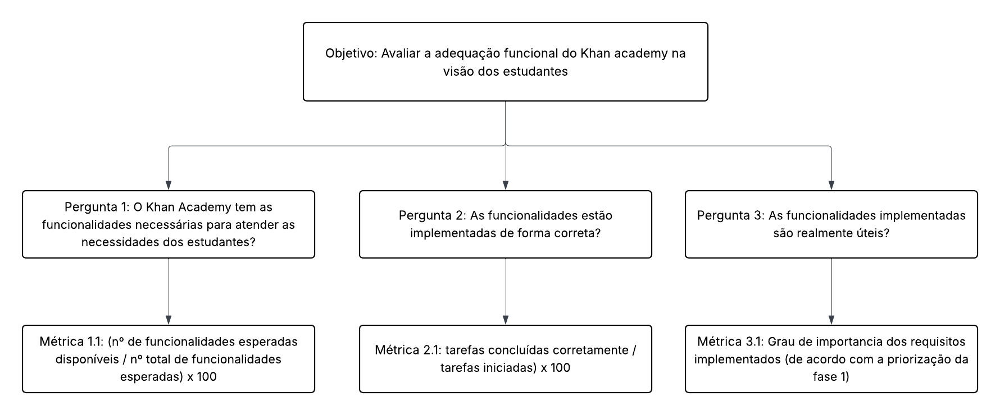

## Objetivo de Medição 1: Adequação funcional 

  <table border="1" cellspacing="0" cellpadding="8" style="border-collapse: collapse; text-align: left;">
    <tr>
      <th><b>Analisar</b></th>
      <td>o Khan Academy</td>
    </tr>
    <tr>
      <th><b>Para o propósito de</b></th>
      <td>Avaliar</td>
    </tr>
    <tr>
      <th><b>Com respeito a</b></th>
      <td>Adequação funcional</td>
    </tr>
    <tr>
      <th><b>Do ponto de vista da</b></th>
      <td>Comunidade de estudantes </td>
    </tr>
    <tr>
      <th><b>No contexto da</b></th>
      <td>Disciplina de Qualidade de Software 1 (FCTE - UnB)</td>
    </tr>
  </table>

  <figcaption>Tabela 1: Objetivo de Medição: Adequação funcional</figcaption>

---

### Perguntas e Hipóteses de Medição

Para decompor o objetivo de análise da Adequação funcional, foram formuladas as seguintes perguntas e hipóteses.

**Questão 1: Completude funcional**
> o Khan Academy tem as funcionalidades necessárias para atender as necessidades dos estudantes?

* **Hipótese 1.1 (H1.1):** Pelo menos 85% das funcionalidades  utilizadas pelos estudantes estarão implementadas e operacionais no sistema.

**Questão 2: Corretude funcional**
> As funcionalidades estão implementadas de forma correta?

* **Hipótese 2.1 (H2.1):** Pelo menos 90% dos casos de uso para estudantes serão executados corretamente, sem apresentar falhas ou erros.

**Questão 3: Apropriação funcional**

> As funcionalidades implementadas são realmente úteis?

* **Hipótese 3.1 (H3.1):** Todas as funcionalidades classificadas anteriormente como críticas serão atendidas.

---

### Seleção das Métricas

**Questão 1: Completude funcional**

* **Métrica 1.1: Cobertura de Funcionalidades Essenciais**
    * **Definição:** Percentual de funcionalidades essenciais (prioritárias para estudantes) que estão implementadas e operacionais no sistema.
    * **Fórmula:**  `(Nº de funcionalidades essenciais disponíveis / Nº total de funcionalidades essenciais esperadas) * 100`
    * **Coleta:** 
        1. Identificar e listar as funcionalidades essenciais para estudantes.
        2. Verificar no sistema se cada funcionalidade está implementada e funcionando corretamente.
        3. Contar o número de funcionalidades essenciais disponíveis e o total esperado.
        4. Aplicar a fórmula para validar a **H1.1**.
    * **Pontuação de Julgamento:** 

       | **Bom** | **Regular** | **Insatisfatório** |
        |:--------:|:-------------:|:-------------------:|
        | 95% a 100% | 94% a 80% | abaixo de 80% |

    * **Justificativa :** 
A definição dos limiares de completude funcional baseia-se em princípios de gerenciamento de projetos. O ideal é 100% de cumprimento do escopo (Pressman), mas um resultado "Bom" (95-100%) é considerado um padrão pragmático de excelência, permitindo o adiamento de funcionalidades de baixíssima prioridade sem impactar o valor central do produto.
A faixa "Intermediária" (80-94%) é associada ao Princípio de Pareto (80/20), sugerindo que o valor essencial do produto foi entregue, mas que ainda existe um "débito de funcionalidades" competitivo.
Um resultado "Ruim" (abaixo de 80%) é um forte indicador de falha no planejamento, pois a ausência de mais de um quinto das funcionalidades esperadas provavelmente compromete a viabilidade e a proposta de valor do produto, sugerindo que funções essenciais foram omitidas.
    * **Propósito:** Avaliar se o sistema atende às necessidades funcionais básicas dos estudantes.

**Questão 2: Corretude funcional**

* **Métrica 2.1: Taxa de sucesso da tarefa**

    * **Definição:** Percentual de tarefas concluídas corretamente em relação ao total de tarefas iniciadas.
    * **Fórmula:** `(Nº de tarefas concluídas corretamente / Nº de tarefas iniciadas) * 100`
    * **Coleta:**
        1. Definir um conjunto representativo de tarefas comuns realizadas por estudantes.
        2. Monitorar a execução dessas tarefas, registrando se foram concluídas com sucesso ou apresentaram falhas.
        3. Contar o número de tarefas concluídas corretamente e o total de tarefas iniciadas.
        4. Aplicar a fórmula para validar a **H2.1**.
    * **Pontuação de Julgamento:** 

        | **Bom** | **Regular** | **Insatisfatório** |
       |:--------:|:-------------:|:-------------------:|
      | acima de 90% | 80% a 90% | abaixo de 80% |

    * **Justificativa :**
    A Taxa de Sucesso da Tarefa (TCT) avalia a eficácia de uma interface, considerando o percentual de tarefas concluídas corretamente. Resultados acima de 90% indicam um design robusto, com a maioria dos usuários atingindo seus objetivos sem dificuldades. Entre 80% e 90%, o sistema ainda é utilizável, mas apresenta pontos de atrito que podem gerar insatisfações e necessitam de ajustes. Abaixo de 80%, a taxa de falha é alta o suficiente para sinalizar problemas graves de usabilidade, que comprometem a experiência do usuário e os objetivos do produto.

    * **Propósito:** Avaliar a precisão e a confiabilidade das funcionalidades implementadas.

**Questão 3: Apropriação funcional**

* **Métrica 3.1: Relevância dos requisitos implementados**

    * **Definição:** Avaliação qualitativa baseada na priorização de requisitos.
    * **Especificação:**
      A avaliação desta métrica se baseia na análise da implementação das funcionalidades em relação à priorização definida na primeira fase deste trabalho. Os requisitos foram classificados de acordo com seu impacto e criticidade no fluxo de usuário principal do estudante (Ex: descobrir conteúdo, estudar, praticar e acompanhar o progresso).

    * **Coleta:** 
        1. Revisar a lista de requisitos priorizados.
        2. Verificar se os requisitos classificados como críticos foram implementados.
        3. Registrar a presença ou ausência desses requisitos no sistema.
        4. Validar a **H3.1** com base na implementação dos requisitos críticos.

    * **Pontuação de Julgamento:** 

        | **Bom** | **Regular** | **Insatisfatório** |
       |:--------:|:-------------:|:-------------------:|
        | 100% dos requisitos críticos para o fluxo principal implementados| Fluxo principal implementado, mas com lacunas em etapas secundárias| Qualquer requisito crítico que quebre o fluxo principal não está implementado|
    * **Justificativa :**
    A avaliação classifica a eficácia com base na implementação dos requisitos críticos para o fluxo de aprendizado do estudante. Resultado Bom ocorre quando 100% dos requisitos essenciais estão implementados, garantindo uma jornada de aprendizado sem interrupções. Resultado Regular é quando o fluxo principal está atendido, mas faltam funcionalidades complementares, tornando a experiência funcional, mas não otimizada. Resultado Insatisfatório ocorre quando requisitos críticos estão ausentes, interrompendo o fluxo de aprendizado e impedindo que o software cumpra sua função essencial.

    * **Propósito:** Avaliar se as funcionalidades implementadas atendem às necessidades essenciais dos estudantes.

### Critérios para Julgamento

* **Aceitável:** ≥ 70% das métricas classificadas como "Bom". O sistema demonstra robustez e previsibilidade.
* **Parcialmente aceitável:** Entre 40% e 69% das métricas com nível "Regular" ou superior. O sistema funciona, mas pode apresentar instabilidades pontuais.
* **Inaceitável:** > 30% das métricas atingindo o nível "Insatisfatório". A estabilidade do sistema é considerada crítica e propensa a falhas.

---

### Relação entre Adequação Funcional, Perguntas e Métricas

  <table border="1" cellspacing="0" cellpadding="8" style="border-collapse: collapse; text-align: left;">
    <tr>
      <th><b>Questão</b></th>
      <th><b>Métricas Simplificadas</b></th>
      <th><b>Tipo de Coleta</b></th>
    </tr>
    <tr>
      <td><b>Completude funcional</b> o Khan Academy tem as funcionalidades necessárias para atender as necessidades dos estudantes?</td>
      <td>
        - Cobertura de Funcionalidades Essenciais (%)
      </td>
      <td>
        - Revisão manual do sistema para identificar funcionalidades essenciais implementadas versus esperadas
      </td>
    </tr>
    <tr>
      <td><b>Corretude funcional</b> As funcionalidades estão implementadas de forma correta?</td>
      <td>
        - Taxa de sucesso da tarefa (%)
      </td>
      <td>
        - Monitoramento da execução de tarefas representativas por estudantes, registrando sucesso ou falhas
      </td>
    </tr>
    <tr>
      <td><b>Apropriação funcional</b> As funcionalidades implementadas são realmente úteis?</td>
      <td>
        - Relevância dos requisitos implementados (% de requisitos críticos implementados)
      </td>
      <td>
        - Revisão da implementação dos requisitos críticos em relação à priorização definida
      </td>
    </tr>
  </table>

  

    <figcaption>Tabela 2: Questões e Métricas Simplificadas</figcaption>
  

---

### Diagrama GQM - Adequação funcional (Representação Estrutural)

### Bibliografia de Referência

* **Nielsen, J. (2012). Usability 101: Introduction to Usability. Nielsen Norman Group.**

* **Pressman, R. S. (2016). Engenharia de Software: Uma Abordagem Profissional. 8ª Edição. McGraw-Hill.**

* **Wiegers, K., & Beatty, J. (2013). Software Requirements. 3rd Edition. Microsoft Press.**

* **International Organization for Standardization (2011). ISO/IEC 25010:2011 - Systems and software engineering — Systems and software Quality Requirements and Evaluation (SQuaRE) — System and software quality models.**
